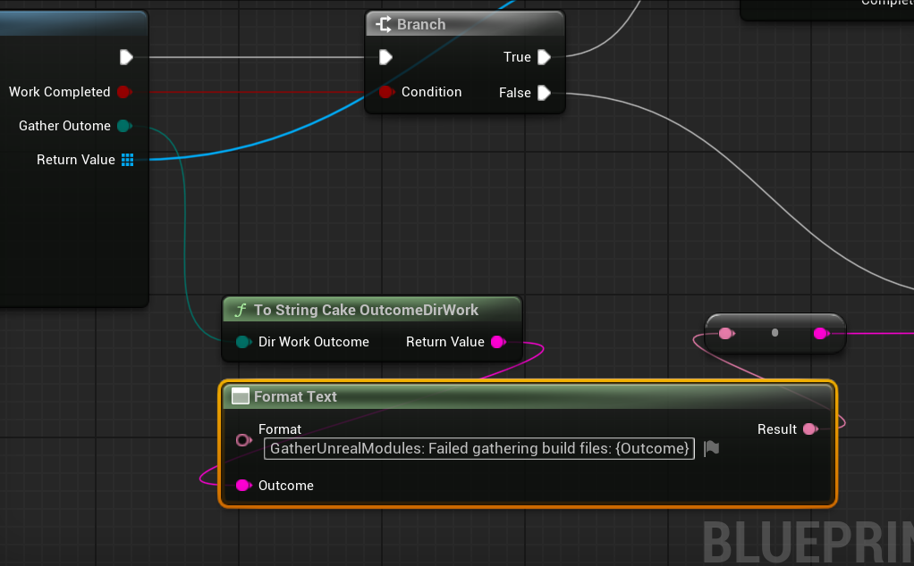
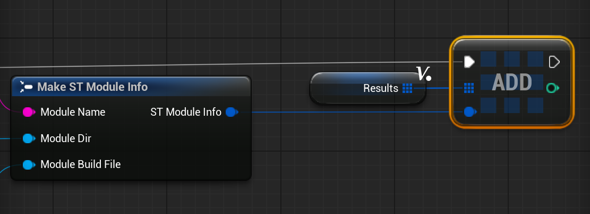
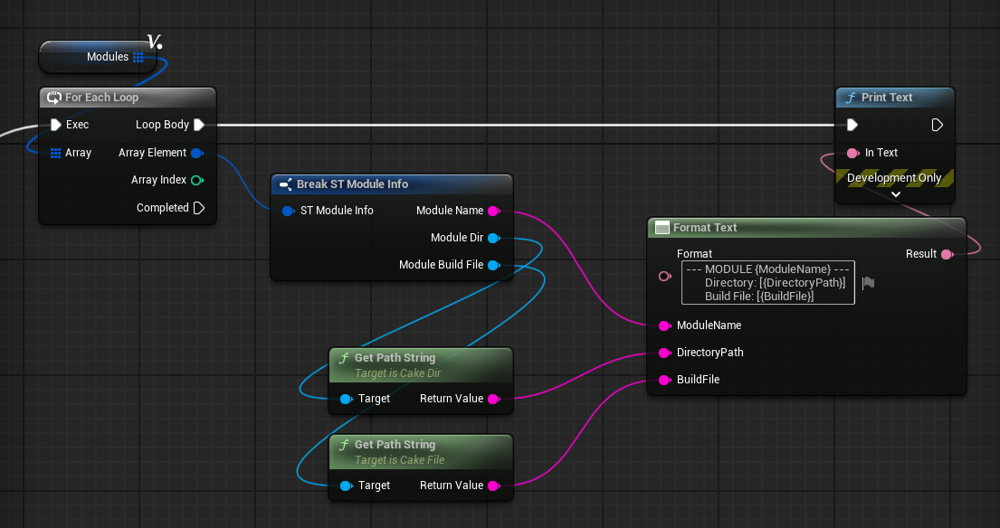

🚩 Goal: Discover all Unreal Modules contained within a directory and store the results in an array for future processing.

📋 Topics covered: [Directory traversal](/core-api/directories#directory-traversal), [path manipulation](/core-api/paths)


## Initial Setup

First off, we'll make need struct to contain all the module information we want to capture. For this example, we'll just capture the essential information.

=== "C++"

    ```c++
    #include "CakeIO/CakeFile.h"
    #include "CakeIO/CakeDir.h"

    /**
    * Contains basic information associated with an Unreal Module.
    */
    struct CAKEIO_BAKERY_API FModuleInfo
    {
        /** The name of the module. */
        FString ModuleName{};

        /** The root directory of the module. */
        FCakeDir ModuleDir{};

        /** The Build.cs file associated with the module. */
        FCakeFile ModuleBuildFile{};
    };
    ```
=== "Blueprint"
    

Next, we'll need to create a place to house our discover modules function.
=== "C++"
    In this example, we're going to place this functionality in a custom Engine Subsystem. This will let us access and use the subsystem's functionality in both editor and game contexts. However, this function does not require any state provided by the subsystem, and so it could easily fit in a static utility library, a freestanding utility function library, or however you'd prefer to organize it.

    ```c++
    #pragma once

    #include "CoreMinimal.h"
    #include "Subsystems/EngineSubsystem.h"

    #include "CakeBakerySubsystem.generated.h"

    /**
    * 
    */
    UCLASS()
    class CAKEIO_BAKERY_API UCakeBakerySubsystem : public UEngineSubsystem
    {
        GENERATED_BODY()

    public:
        /** Implement this for initialization of instances of the system */
        virtual void Initialize(FSubsystemCollectionBase& Collection) override; 

        /** Implement this for deinitialization of instances of the system */
        virtual void Deinitialize() override;

    };
    ```
=== "Blueprint"
For Blueprint, we're just going to add this function to a Blueprint Function Library.

## Writing the Core Logic
With the initial setup done, let's focus on writing the core logic for discovering modules. Our function will return an array of ModuleInfo structs, with each struct holding the information for a unique module discovered in the source directory. We want the user to be able to specify which directory path we should search for modules, and so this function will take a [CakePath](/core-api/paths) object as a parameter.

=== "C++"


    ```c++ hl_lines="25-29"
    #pragma once

    #include "CoreMinimal.h"
    #include "Subsystems/EngineSubsystem.h"

    #include "ModuleInfo.h"

    #include "CakeBakerySubsystem.generated.h"

    /**
    * 
    */
    UCLASS()
    class CAKEIO_BAKERY_API UCakeBakerySubsystem : public UEngineSubsystem
    {
        GENERATED_BODY()

    public:
        /** Implement this for initialization of instances of the system */
        virtual void Initialize(FSubsystemCollectionBase& Collection) override; 

        /** Implement this for deinitialization of instances of the system */
        virtual void Deinitialize() override;

        /** 
        * Finds all modules contained within SourceDirectory.
        * @return An array of ModuleInfo objects that contains all modules discovered.
        */
        TArray<FModuleInfo> GatherUnrealModules(const FCakePath& SourceDirPath);

    };
    ```
=== "Blueprint"
    

Every module in Unreal requires a build file that uses the following structure `<ModuleName>.Build.cs`. We can detect modules by traversing a directory and identifying any build files. We'll take the directory path our caller submits and build a CakeDir object whose extension filter contains the single extension `.Build.cs`. 


=== "C++"

    ```c++ 
    TArray<FModuleInfo> UCakeBakerySubsystem::GatherUnrealModules(const FCakePath& SourceDirPath)
    {
        TArray<FModuleInfo> GatheredModules{};
        FCakeDir SourceDir{ SourceDirPath, TEXTVIEW("Build.cs") };
        //...

        return GatheredModules;
    }
    ```

=== "Blueprint"
    

Next, we'll ensure that the directory the caller supplied actually exists on the filesystem before proceeding. We'll emit a warning if the directory doesn't exist.

=== "C++"

    ```c++ 
    TArray<FModuleInfo> UCakeBakerySubsystem::GatherUnrealModules(const FCakePath& SourceDirPath)
    {

        TArray<FModuleInfo> GatheredModules{};
        FCakeDir SourceDir{ SourceDirPath, TEXTVIEW("Build.cs") };

        if (SourceDir.Exists())
        {
            // ...
        }
        else 
        {
            UE_LOG(LogBakerySubsystem, Warning, 
                TEXT("GatherUnrealModules: Sent a directory that does not exist."));
        }

        return GatheredModules;
    }
    ```

=== "Blueprint"
    Note the sequence we have added to ensure we return the results after the gather operation resolves.
    

Now all we have to do is use the directory object to find all build files, and build a ModuleInfo struct for each build file we encounter.

=== "C++"
    
    While we could use the CakeMix function GatherFilesWithFilter, we'll write our own custom traversal callback.  

    ```c++ 
    TArray<FModuleInfo> UCakeBakerySubsystem::GatherUnrealModules(const FCakePath& SourceDirPath)
    {
        TArray<FModuleInfo> GatheredModules{};

        // ...

        if (SourceDir.Exists())
        {
            auto FileCallback = [&GatheredModules](FCakeFile NextBuildFile) -> void
            {
                GatheredModules.Emplace(
                    NextBuildFile.CloneFileNameBare(),
                    FCakeDir(NextBuildFile.GetPath().CloneParentPath()),
                    NextBuildFile
                );
            };

        }
        // ...
        return GatheredModules;
    }
    ```

    Since we're going to be using a filtered traversal, we know that every CakeFile object we are sent in this callback is a build file. All we have to do is capture a mutable reference to the GatheredModules collection and add a ModuleInfo struct for each file we get from the traversal.

    Let's break down what's happening in that Emplace call. Remember, module build files use the following naming pattern: `ModuleName.Build.cs`. Therefore, we can use CloneFileNameBare to remove the extensions and capture the ModuleName field. Next, we can build a CakeDir object of the module directory by capturing the parent path of the build file. Setting the build file field is simple, we just copy the CakeFile object we were sent.

    !!! hint
        You might be wondering why we didn't call MoveTemp on NextBuildFile since we aren't going to use it; this would be a great idea if we didn't have to use NextBuildFile for all the arguments to the Emplace call. Since argument order evaluation isn't fixed, we could easily create a situation where the move occurs before the calls to CloneFileNameBare or CloneParentPath resolve, which would give us incorrect module names or paths. In situations where performance is paramount, we would want to cache the calls dependent on the object first, and then we could move those (as well as the CakeFile object) in the Emplace call.

    Now, with our callback built, the rest is simple. We merely need to traverse files at any depth to discover all the modules contained within the source directory. We don't do any IO operations that can fail in our file callback, so we don't need to use a guarded traversal. Here we'll just use an unguarded filter traversal, specifying the Deep operation depth to ensure we search all children of the source directory as well.

    ```c++ 
    TArray<FModuleInfo> UCakeBakerySubsystem::GatherUnrealModules(const FCakePath& SourceDirPath)
    {
        TArray<FModuleInfo> GatheredModules{};

        // ...

        if (SourceDir.Exists())
        {
            auto FileCallback = [&GatheredModules](FCakeFile NextBuildFile) -> void
            {
                GatheredModules.Emplace(
                    NextBuildFile.CloneFileNameBare(),
                    FCakeDir(NextBuildFile.GetPath().CloneParentPath()),
                    NextBuildFile
                );
            };

            FCakeResultTraversal TraversalResult =
                SourceDir.TraverseFilesWithFilter(ECakePolicyOpDepth::Deep, MoveTemp(FileCallback));

            if (!TraversalResult)
            {
                UE_LOG(LogBakerySubsystem, Error,
                    TEXT("GatherUnrealModules: Traversal failed to completed: [%s]"),
                    *TraversalResult.ToString()
                );
            }
        }
        // ...
        return GatheredModules;
    }
    ```
    If the traversal fails to launch, we'll log the error. 
    
    And that's it! Here's the complete function, ready for use:

    ```c++
    TArray<FModuleInfo> UCakeBakerySubsystem::GatherUnrealModules(const FCakePath& SourceDirPath)
    {

        TArray<FModuleInfo> GatheredModules{};
        FCakeDir SourceDir{ SourceDirPath, TEXTVIEW("Build.cs") };

        if (SourceDir.Exists())
        {
            auto FileCallback = [&GatheredModules](FCakeFile NextBuildFile) -> void
            {
                GatheredModules.Emplace(
                    NextBuildFile.CloneFileNameBare(),
                    FCakeDir(NextBuildFile.GetPath().CloneParentPath()),
                    NextBuildFile
                );
            };

            FCakeResultTraversal TraversalResult =
                SourceDir.TraverseFilesWithFilter(ECakePolicyOpDepth::Deep, MoveTemp(FileCallback));

            if (!TraversalResult)
            {
                UE_LOG(LogBakerySubsystem, Error,
                    TEXT("GatherUnrealModules: Traversal failed to completed: [%s]"),
                    *TraversalResult.ToString()
                );
            }
        }
        else // SourceDir does not exist
        {
            UE_LOG(LogBakerySubsystem, Warning, TEXT("GatherUnrealModules: Sent a directory that does not exist."));
        }

        return GatheredModules;
    }
    ```

=== "Blueprint"
    Since we decided to put our function in a Blueprint Function Library, we won't be able to use a custom iteration pattern. The reason for this is that we need to update the results array each time the callback is invoked, but the functions in a Blueprint Function Library are static and we can't store state in the library itself. Luckily, there's a CakeMix function that will do exaclty what we need. We'll use GatherFilesWithFilter, sending in our directory object whose extension filter has already been set:

    

    We'll check to ensure the gather operation succeeded, and log if an error was encountered.

    

    Assuming the gather operation succeeds, we need to create a ModuleInfo struct for each file that was gathered. Remember, since the file extension filter was set to `.Build.cs` we know that every file gathered was a build file.

    


    Creating the ModuleInfo struct now that we have the build file. Remembering the naming pattern `ModuleName.Build.cs`, we can get the module name by calling `CloneFileNameBare`, which will remove the extensions ".Build.cs". To get the root directory of the module, we just need to get the path to the directory that holds the build file. We can get that easily by calling `CloneParentPath` on the file object. Finally, we already have the file object we need for the build file, so we can just pass that along. 

    

    Afterward, we just need to add this newly created struct to our results array:

    

## Using the Function
Let's try out our new module discovery function. For now we'll just print some basic info for each ModuleInfo object gathered.


=== "C++"

    ```c++
    auto* Subsys{ GEngine->GetEngineSubsystem<UCakeBakerySubsystem>() };

    FCakePath SourcePath{
        TEXTVIEW("X:/Projects/CakeBakery/Source")
    };

    TArray<FModuleInfo> Modules{
        Subsys->GatherUnrealModules(SourcePath)
    };

    UE_LOG(LogTemp, Warning, TEXT("TestModuleFinder: Found [%d] module(s) at location: [%s]."),
        Modules.Num(),
        **SourcePath
    );
    for (const FModuleInfo& Mod : Modules)
    {
        UE_LOG(LogTemp, Warning, TEXT("MODULE: [%s]"), *Mod.ModuleName);
        UE_LOG(LogTemp, Warning, TEXT("           DIR: [%s]"), *Mod.ModuleDir.GetPathString());
        UE_LOG(LogTemp, Warning, TEXT("    BUILD FILE: [%s]"), *Mod.ModuleBuildFile.GetPathString());
    }
    ```

=== "Blueprint"
    


    